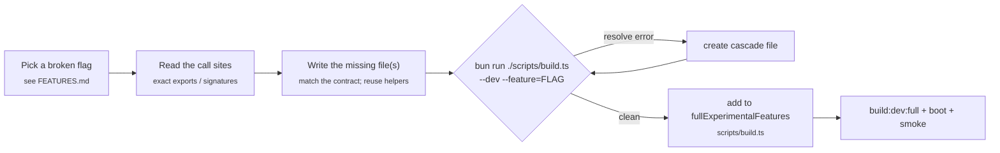

# Contributing to Fexor Code

Thanks for your interest. The highest-value contributions right now are
**reconstructing broken feature flags** and improving provider fidelity.

## Getting set up

```bash
git clone https://github.com/jennofrie/fexor-code.git
cd fexor-code
bun install
bun run build:dev:full   # → ./cli-dev (all experimental flags)
./cli-dev --version
```

A full build is ~4 seconds, so iterate freely.

## The reconstruction workflow

The leaked snapshot is missing source files for many `feature('FLAG')` flags.
Restoring one follows a tight, verifiable loop:



1. **Pick a flag** from the broken list in [FEATURES.md](FEATURES.md).
2. **Read the consumers** first. `feature('X')`-gated `require()` sites tell you the exact module path, exported symbol names, and signatures you must satisfy. A wrong export name or path breaks the bundle.
3. **Write the minimum correct code.** Reuse existing helpers/backends rather than reimplementing. No new dependencies unless unavoidable. No speculative configuration.
4. **Verify in isolation:** `bun run ./scripts/build.ts --dev --feature=YOUR_FLAG`. A clean `Built ./cli-dev` means it resolves. Expect **cascades** — an existing consumer may import a *sibling* file that's also missing; create those too.
5. **Ship it:** add the flag to `fullExperimentalFeatures` in `scripts/build.ts`, then `bun run build:dev:full` and boot-check (`./cli-dev --version`). Smoke-test any non-interactive surface (e.g. `./cli-dev ps`, `./cli-dev list`).

> `feature('X')` is a `bun:bundle` macro and **must be the direct condition of an `if`/ternary** — never inside a larger boolean expression (`feature('X') && y` fails to bundle).

## Conventions

- **Commits:** [Conventional Commits](https://www.conventionalcommits.org/) — `feat:`, `fix:`, `chore:`, `docs:`, `refactor:`.
- **Style:** match the surrounding file. ESM with `.js` import specifiers that resolve to `.ts`/`.tsx`. Tools via `buildTool` (`src/Tool.ts`); commands via the local `Command` type; schemas via Zod v4.
- **Surgical changes:** touch only what the task requires; don't refactor adjacent code or remove pre-existing dead code unless asked.
- **No telemetry, no callbacks home.** Don't reintroduce outbound analytics.

## Pull requests

1. Fork → `git checkout -b feat/my-flag`.
2. Keep the diff focused; update `FEATURES.md` / `CHANGELOG.md` if you restore a flag.
3. Confirm `bun run build:dev:full` is green and the binary boots.
4. Open a PR using the template; describe what you reconstructed and how you verified it.

## Security

Never commit `.env*`, API keys, or tokens (they are git-ignored). See [SECURITY.md](SECURITY.md).

---

Maintained by **Profexor**.
