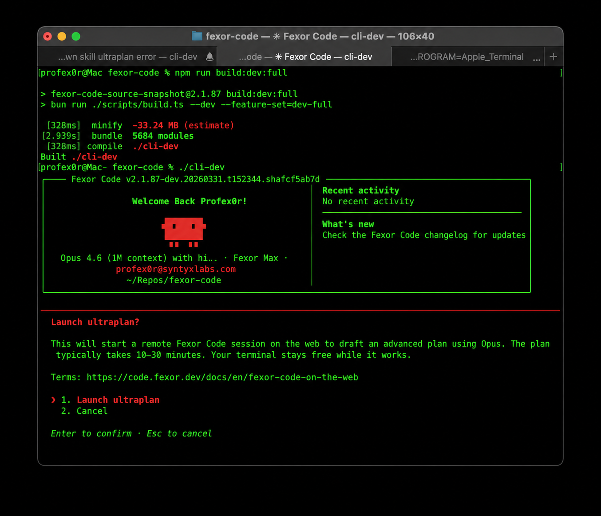
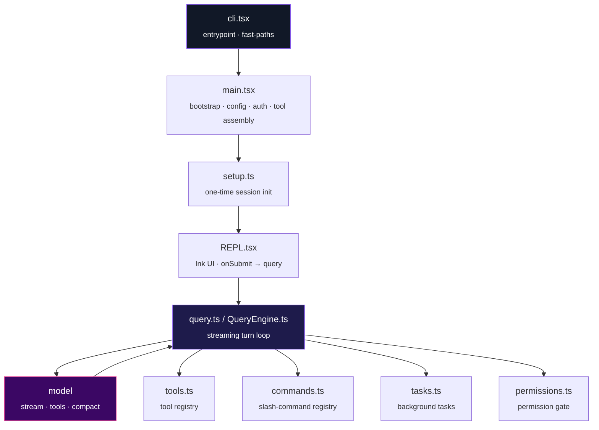
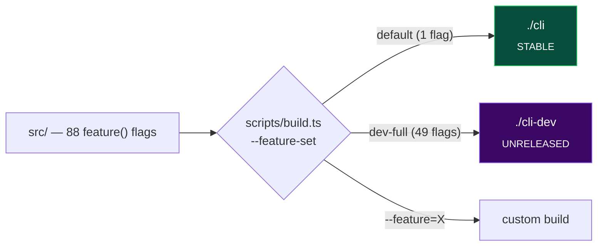
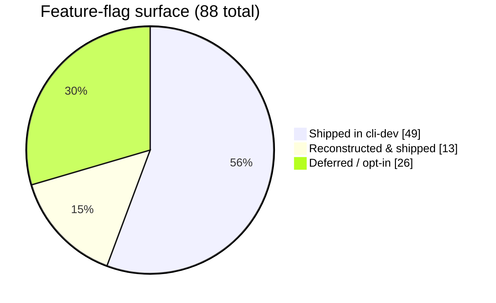
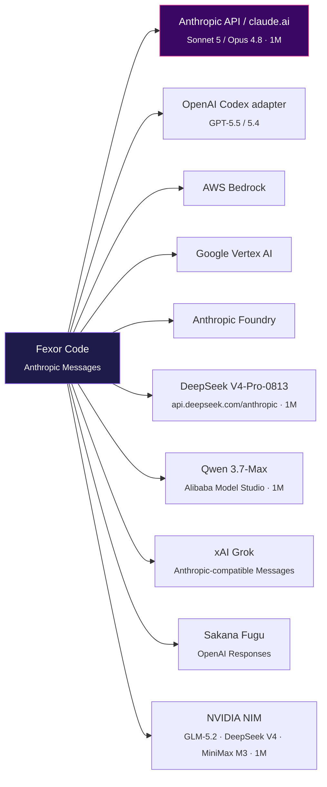

<div align="center">



# Fexor Code

### The free build of Claude Code — telemetry stripped, guardrails removed, experimental features unlocked & **reconstructed**.

<br/>

[](#-build)
[](https://bun.sh)
[](https://www.typescriptlang.org/)
[](#-license)

[](FEATURES.md)
[](#-model-providers)
[](#-model-providers)
[](#-reconstruction-status)
[](#-maintainer)

<sub>One binary · zero callbacks home · seven model providers · up to a 1M-token window</sub>

</div>

---

## ✨ What is this

A clean, buildable fork of Anthropic's [Claude Code](https://docs.anthropic.com/en/docs/claude-code) CLI — the terminal-native AI coding agent. The upstream source became publicly available on **March 31, 2026** through a source-map exposure in the npm distribution. `fexor-code` applies four categories of work on top of that snapshot:

|     | Category                           | What it means                                                                                                                                                                                                               |
| :-: | ---------------------------------- | --------------------------------------------------------------------------------------------------------------------------------------------------------------------------------------------------------------------------- |
| 🛰️  | **Telemetry removed**              | OpenTelemetry/gRPC, GrowthBook reporting, Sentry, and event logging are dead-code-eliminated or stubbed. GrowthBook gates still evaluate locally (needed for runtime feature flags) but **never report home**.              |
| 🔓  | **Guardrails removed**             | The CLI's prompt-level refusal patterns, injected "cyber-risk" blocks, and managed-settings overlays are stripped. The model's own safety training still applies — this only removes the extra wrapper layer.               |
| 🧪  | **Experimental features unlocked** | Claude Code ships **88** `bun:bundle` compile-time feature flags, most disabled in the public release. The full build enables a curated set.                                                                                |
| 🧩  | **Missing features reconstructed** | The leaked snapshot was missing source files for dozens of flags. **13 of them have been rebuilt** to their original call-site contracts and verified to compile + boot. → [Reconstruction status](#-reconstruction-status) |

> [!NOTE]
> `fexor-code` is a **nominative fork** — it references "Claude Code" only to describe what it forks. It is maintained independently by **Profexor** and is not affiliated with or endorsed by Anthropic.

---

## 🏛️ Architecture

The CLI is a thin bootstrap that fans out into a streaming agent loop. `feature('FLAG')` is a Bun compile-time macro: disabled branches are dead-code-eliminated, so the stable binary stays lean while the dev binary compiles the experimental surface in.



📖 Full deep-dive with subsystem maps: **[docs/ARCHITECTURE.md](docs/ARCHITECTURE.md)**

---

## 🚩 The feature-flag system

Every flag is a `feature('NAME')` macro resolved at **build time**. The build script chooses which flags to compile in:



|                   | `./cli` — **stable**             | `./cli-dev` — **unreleased**            |
| ----------------- | -------------------------------- | --------------------------------------- |
| Build             | `bun run build`                  | `bun run build:dev:full`                |
| Flags compiled in | `VOICE_MODE` only                | **49** experimental flags               |
| Defines           | `USER_TYPE=external`             | + `CLAUDE_CODE_EXPERIMENTAL_BUILD=true` |
| Posture           | Production-like, minimal surface | Everything unlocked + reconstructed     |

Build is **fast** — a full `cli-dev` is ~4 s (≈5,700 modules bundled + bytecode-compiled by Bun).

---

## 🧩 Reconstruction status

The leaked snapshot referenced flags whose source files were missing — enabling them broke the build. **13 high-value flags have been reconstructed** (files rebuilt to their exact call-site contracts, verified per-flag, then shipped in `cli-dev`).



<table>
<tr><th>Wave</th><th>Flag</th><th>Restores</th></tr>
<tr><td rowspan="8"><b>Wave 1</b></td><td><code>BG_SESSIONS</code></td><td><code>ps</code>/<code>logs</code>/<code>attach</code>/<code>kill</code> background sessions + <code>--bg</code></td></tr>
<tr><td><code>FORK_SUBAGENT</code></td><td><code>/fork</code> conversation branching</td></tr>
<tr><td><code>MONITOR_TOOL</code></td><td>watch-a-command Monitor tool + background task</td></tr>
<tr><td><code>MCP_SKILLS</code></td><td>skills sourced from MCP <code>skill://</code> resources</td></tr>
<tr><td><code>BUDDY</code></td><td><code>/buddy</code> terminal companion</td></tr>
<tr><td><code>AUTO_THEME</code></td><td>live light/dark terminal detection (OSC 11)</td></tr>
<tr><td><code>COMMIT_ATTRIBUTION</code></td><td>commit/PR attribution trailers + hooks</td></tr>
<tr><td><code>CONTEXT_COLLAPSE</code></td><td><code>CtxInspect</code> tool over the collapse subsystem</td></tr>
<tr><td rowspan="5"><b>Wave 2</b></td><td><code>HISTORY_SNIP</code></td><td><code>Snip</code> tool + <code>/force-snip</code> to drop history ranges</td></tr>
<tr><td><code>TEMPLATES</code></td><td><code>new</code>/<code>list</code>/<code>reply</code> job CLI subcommands</td></tr>
<tr><td><code>REACTIVE_COMPACT</code></td><td>413 / prompt-too-long recovery compaction</td></tr>
<tr><td><code>RUN_SKILL_GENERATOR</code></td><td>bundled skill that scaffolds new skills</td></tr>
<tr><td><code>WEB_BROWSER_TOOL</code></td><td>fetch-and-read web tool (dependency-light)</td></tr>
</table>

<details>
<summary><b>Deferred on purpose</b> (reconstructable, but not shipped on-by-default)</summary>

| Flag                                    | Why deferred                                                                                         |
| --------------------------------------- | ---------------------------------------------------------------------------------------------------- |
| `MEMORY_SHAPE_TELEMETRY`                | Telemetry — against this fork's no-telemetry posture                                                 |
| `OVERFLOW_TEST_TOOL`                    | Test scaffolding only, no user value                                                                 |
| `TRANSCRIPT_CLASSIFIER`                 | The auto-approve permission classifier — a safety boundary that should be **opt-in**                 |
| `DIRECT_CONNECT`                        | Needs the full `claude server` subsystem (L/XL); `parseConnectUrl.ts` groundwork is already in place |
| `KAIROS` · `PROACTIVE` · `KAIROS_DREAM` | Large always-on assistant stacks; backend-coupled                                                    |

</details>

Full audit of all 88 flags → **[FEATURES.md](FEATURES.md)**.

---

## 🌐 Model providers

`fexor-code` speaks the Anthropic Messages format internally and routes it to multiple backends. Third-party Anthropic-compatible endpoints pass through natively; OpenAI/Codex, Sakana, and NVIDIA use protocol translation adapters.



Each provider has a dedicated, **tuned** launcher that maximizes its context window and tool-use fidelity:

| Launcher                              | Model                                      | Context window | Highlights                                                                                      |
| ------------------------------------- | ------------------------------------------ | -------------: | ----------------------------------------------------------------------------------------------- |
| `fexor-launch.sh`                     | Claude Opus 4.8 `[1m]`                     |         **1M** | native subscription, adaptive thinking, 128K output                                             |
| `launch-claude-opus45.sh`             | Claude Opus 4.8 `[1m]`                     |         **1M** | OAuth-clean, `/model` picker entry                                                              |
| `launch-gpt.sh`                       | GPT-5.5 (or 5.4)                           |     400K–1.05M | Codex adapter, `xhigh` reasoning, verbosity `medium`                                            |
| `launch-grok.sh`                      | Grok 4.5                                   |       **500K** | xAI OAuth (`~/.grok/auth.json`) or `XAI_API_KEY`, Anthropic-compatible Messages                 |
| `launch-fugu.sh`                      | Sakana Fugu                                |         **1M** | OpenAI Responses adapter, isolated API-key config, Fugu-specific harness prompt                 |
| `launch-nvidia.sh`                    | GLM-5.2, DeepSeek V4-Pro/Flash, MiniMax M3 |         **1M** | NVIDIA free hosted NIM; model profiles, Keychain-backed API key, Chat Completions adapter       |
| `launch-glm.sh`                       | GLM 5.2 `[1m]` (5.3 selectable)            |         **1M** | Z.AI Anthropic-compatible API, max effort, autonomy addendum                                    |
| `launch-deepseek.sh`                  | DeepSeek V4-Pro / Flash                    |         **1M** | Pro default (max effort); Flash via `--model deepseek-v4-flash` (high floor); 64K / 384K output |
| `launch-qwen37.sh`                    | Qwen 3.7-Max                               |         **1M** | beta-strip, prompt caching preserved                                                            |
| `launch-qwen36-abliterated-runpod.sh` | local/RunPod Qwen abliterated GGUF         |     up to 256K | llama.cpp / LiteLLM; `--bare` default                                                           |

Third-party launchers (DeepSeek, NVIDIA, Grok, GPT, Qwen, GLM) append `prompts/autonomy-system-prompt.md` by default — a short “don’t moralize, assume authorized research” addendum. This does **not** uncensored the model weights. Disable with `FEXOR_AUTONOMY_PROMPT=0`. GLM’s copy lives at `prompts/glm-autonomy-system-prompt.md`. Fugu keeps its own prompt. Anthropic OAuth launchers do not append it.

Opt-in GLM coding harness (verifier + LSP + discipline prompt): `FEXOR_CODING_HARNESS=1 ./launch-glm.sh`. Contract: **[docs/VERIFICATION_CONTRACT.md](docs/VERIFICATION_CONTRACT.md)**.

The NVIDIA launcher accepts either a short profile name or the exact NIM model
ID:

```bash
./launch-nvidia.sh                         # GLM-5.2
./launch-nvidia.sh --model deepseek-pro
./launch-nvidia.sh --model deepseek-flash
./launch-nvidia.sh --model minimax-m3
```

| NVIDIA profile                  | Reasoning control        |                         Output |
| ------------------------------- | ------------------------ | -----------------------------: |
| `z-ai/glm-5.2`                  | model-native             | 16,384 default; 32,768 maximum |
| `deepseek-ai/deepseek-v4-pro`   | `reasoning_effort=max`   |                 16,384 maximum |
| `deepseek-ai/deepseek-v4-flash` | `reasoning_effort=max`   |                 16,384 maximum |
| `minimaxai/minimax-m3`          | `thinking_mode=adaptive` |                 16,384 maximum |

MiniMax M3 exposes enabled, disabled, and adaptive thinking—not an effort tier
named `max`. The launcher therefore uses adaptive mode and does not send an
unsupported max value. All four profiles budget a 1,000,000-token context.
On macOS the launcher reads the `nvidia_api_key` Keychain service. On Linux it
reads `~/.config/fexor-code/nvidia_api_key` and refuses the file unless it is a
regular, non-symlinked file with `0600` permissions.

> [!TIP]
> Three source patches make this possible: first-party `sonnet` now resolves to Claude Sonnet 5 with native 1M context, `CLAUDE_CODE_MAX_CONTEXT_TOKENS` is honored in external builds (so third-party 1M models budget correctly instead of defaulting to 200K), and the latest Claude output ceilings are lifted to 128K where supported. Details in **[docs/ARCHITECTURE.md](docs/ARCHITECTURE.md#model--provider-resolution)**.

<details>
<summary><b>Context windows at a glance</b></summary>

| Model                  |                Context | Max output | Notes                                                       |
| ---------------------- | ---------------------: | ---------: | ----------------------------------------------------------- |
| Claude Sonnet 5        |              1,000,000 |    128,000 | native default, no `[1m]` required                          |
| Claude Opus 4.8 `[1m]` |              1,000,000 |    128,000 | native 1M                                                   |
| GPT-5.4                |              1,050,000 |    128,000 | xhigh reasoning                                             |
| GPT-5.5                | 1,000,000 (400K Codex) |          — | strongest long-context                                      |
| DeepSeek V4-Pro-0813   |              1,000,000 |    384,000 | hosted as `deepseek-v4-pro`; reasoning consumes context     |
| DeepSeek V4-Flash-0731 |              1,000,000 |    384,000 | `--model deepseek-v4-flash`; launcher effort floor **high** |
| Qwen 3.7-Max           |              1,000,000 |     65,536 | agent-tuned, verbose                                        |

</details>

---

## ⚡ Quick install

```bash
curl -fsSL https://raw.githubusercontent.com/jennofrie/fexor-code/main/install.sh | bash
```

Checks your system, installs Bun if needed, clones the repo, builds with the full feature set, and symlinks `fexor-code` onto your `PATH`. Then run `fexor-code` and `/login`.

## 🔨 Build

```bash
git clone https://github.com/jennofrie/fexor-code.git
cd fexor-code
bun install
bun run build      # → ./cli       (stable)
bun run build:dev:full   # → ./cli-dev (all experimental flags)
```

| Command                                  | Output       | Features                      |
| ---------------------------------------- | ------------ | ----------------------------- |
| `bun run build`                          | `./cli`      | `VOICE_MODE` only             |
| `bun run build:dev`                      | `./cli-dev`  | dev version stamp             |
| `bun run build:dev:full`                 | `./cli-dev`  | **all 49 experimental flags** |
| `bun run compile`                        | `./dist/cli` | alternative output path       |
| `bun run ./scripts/build.ts --feature=X` | custom       | enable specific flags         |

## ▶️ Usage

```bash
./cli                              # interactive REPL
./cli -p "what files are here?"    # one-shot
./cli --model claude-opus-4-8      # specify model
./launch-gpt.sh                    # GPT-5.5 via Codex
./launch-deepseek.sh               # DeepSeek V4-Pro (1M, max effort)
./launch-deepseek.sh --model deepseek-v4-flash   # Flash, effort high
FEXOR_AUTONOMY_PROMPT=0 ./launch-deepseek.sh     # skip autonomy addendum
./launch-glm.sh                    # GLM 5.2, autonomy addendum on
./cli ps                           # list background sessions (BG_SESSIONS)
```

---

## 🎙️ Voice mode

`/voice` (push-to-talk dictation) is compiled into every build, but it has two halves with different requirements:

- 🎙️ **Recording** uses [SoX](http://sox.sourceforge.net/) (`brew install sox`) — provider-agnostic.
- 🧠 **Transcription** uses Anthropic's `voice_stream` endpoint — **claude.ai-OAuth only** (not API keys, Bedrock, Vertex, Foundry, or OpenAI/Codex).

| Launcher / binary                                                                 | `/voice`                           |
| --------------------------------------------------------------------------------- | ---------------------------------- |
| `fexor-launch.sh`, `launch-claude-opus45.sh`                                      | ✅ launch with `FEXOR_VOICE=1`     |
| `cli` / `cli-dev` after `/login` to claude.ai                                     | ✅                                 |
| `launch-deepseek.sh` (DeepSeek), `launch-qwen37.sh` (Qwen), `launch-gpt.sh` (GPT) | ❌ transcription is claude.ai-only |

**To use it:** `brew install sox`, then `FEXOR_VOICE=1 ./fexor-launch.sh`, `/login` to your claude.ai account, run `/voice`, and hold **Space** to talk. The `FEXOR_VOICE=1` flag loads user settings so the toggle persists — the Claude launchers are OAuth-clean and don't load them by default.

## 🗂️ Project structure

```
scripts/build.ts          # feature-flag build system
src/
  entrypoints/cli.tsx      # CLI entrypoint
  main.tsx                 # bootstrap (config, auth, tool/MCP/agent assembly)
  setup.ts                 # one-time session init
  screens/REPL.tsx         # Ink/React interactive UI
  query.ts · QueryEngine.ts# streaming turn loop
  commands.ts · tools.ts · tasks.ts   # registries
  commands/ · tools/ · tasks/          # implementations (incl. reconstructed)
  services/                # API clients, OAuth/MCP, compaction, analytics stubs
  utils/model/             # provider routing, context/effort resolution
  skills/ · plugins/ · bridge/ · voice/
docs/ARCHITECTURE.md       # architecture deep-dive
```

## 🧰 Tech stack

|                 |                                                                |
| --------------- | -------------------------------------------------------------- |
| **Runtime**     | [Bun](https://bun.sh) ≥ 1.3.11                                 |
| **Language**    | TypeScript 5.x                                                 |
| **Terminal UI** | React 19 + [Ink](https://github.com/vadimdemedes/ink)          |
| **CLI parsing** | Commander.js · **Validation** Zod v4                           |
| **Protocols**   | MCP · LSP                                                      |
| **APIs**        | Anthropic Messages · OpenAI Codex · Bedrock · Vertex · Foundry |

---

## 🗺️ Roadmap

- [x] Audit the full 88-flag surface (stable vs unreleased)
- [x] **Wave 1** — reconstruct 8 high-value flags
- [x] **Wave 2** — reconstruct 5 more flags
- [x] Per-provider launcher tuning + 1M context patches
- [ ] `DIRECT_CONNECT` — reconstruct the `claude server` subsystem
- [ ] Opt-in reconstructions (`TRANSCRIPT_CLASSIFIER`, …)
- [ ] Continuous `FEATURES.md` / docs sync

---

## 🤝 Contributing

Contributions are welcome — especially restoring more of the broken flags. Start with **[CONTRIBUTING.md](CONTRIBUTING.md)**: it documents the build, the reconstruction workflow (rebuild a missing file to its call-site contract → verify with a per-flag build → ship), and the conventions.

## 🔐 Security

Found a vulnerability or a leaked secret in history? See **[SECURITY.md](SECURITY.md)** for responsible-disclosure guidance. Never commit `.env*`, API keys, or tokens — they are git-ignored by default.

## 📜 Changelog

See **[CHANGELOG.md](CHANGELOG.md)** for the full history, including the audit, the two reconstruction waves, and the provider-tuning work.

---

## 👤 Maintainer

Built and maintained by **Profexor**.

> The original Claude Code source is the property of Anthropic. This fork exists because the source was publicly exposed through Anthropic's own npm distribution; it is referenced nominatively to describe what `fexor-code` is. Use at your own discretion.

## 📄 License

Source-available. The upstream Claude Code source remains the property of Anthropic. This repository carries no warranty.

<div align="center"><sub>Maintained by <b>Profexor</b> · built with Bun · no telemetry, no callbacks home</sub></div>

---

## Digital Facial Prosthetic Training Pipeline

`train_prosthetic.py` fine-tunes a pretrained StyleGAN2 face generator on a person's photo set, then trains a small expression network that maps facial Action Units and head pose into W+ style offsets. The output is a set of model weights for a separate inference pipeline.

### Purpose

The tool is designed for identity-preserving face synthesis from:

- A photo collection of the subject.
- A pretrained StyleGAN2 or StyleGAN2-ADA FFHQ generator checkpoint.
- Optional pre-injury video used to learn expression variation.

It produces:

- A tuned generator.
- The subject's canonical identity latent.
- An Action Unit driven expression hypernetwork.
- Live-mode FP16 and batch-mode FP32 export bundles.

### Architecture

```text
Phase 1: Curate
  Input photos -> face selection -> quality filters -> lighting normalization -> aligned 1024x1024 images

Phase 2: Invert
  Aligned photos -> batched W+ optimization -> inverted_latents.pt

Phase 3: Tune
  Real aligned photos + W+ latents -> PTI fine-tuning -> validation metrics -> checkpoints

Phase 4: Expression
  Video frames -> FaceMesh landmark blendshape proxy -> 17 Action Units -> expression hypernetwork

Phase 5: Export
  Tuned generator + identity latent + hypernetwork -> live and batch inference bundles
```

### Implemented improvements

| Area                   | What was added                                      | Benefit                                            |
| ---------------------- | --------------------------------------------------- | -------------------------------------------------- |
| Mixed precision        | CUDA AMP with GradScaler                            | Faster training and lower memory use on CUDA GPUs  |
| Batched inversion      | Independent W+ variables optimized in batches       | Better GPU utilization during Phase 2              |
| Validation split       | Stratified holdout from photo-latent pairs          | Detects overfitting during PTI                     |
| Early stopping         | Stops PTI after validation stagnation               | Prevents wasted epochs and overfitting             |
| Gradient accumulation  | Configurable effective batch size                   | More stable PTI updates                            |
| Structured logging     | `train.log` plus `metrics.jsonl`                    | Persistent run logs and comparable metrics         |
| Config files           | `--config` with JSON or YAML                        | Reproducible runs without long CLI commands        |
| Dataset manifest       | SHA-256 hashes for source and aligned photos        | Auditable dataset versioning                       |
| HEIC/HEIF support      | Optional `pillow-heif` decoding                     | Supports modern iPhone exports                     |
| Multi-face handling    | Selects largest/most-centered detected face         | Recovers useful group photos                       |
| Occlusion guard        | Key landmark visibility check                       | Rejects low-confidence face detections             |
| Lighting normalization | Histogram match to best identity anchor             | Reduces lighting variance before inversion         |
| Quality metrics        | FID/KID-style proxy metrics from embedding features | Tracks whether tuning improves or degrades outputs |

### Improvements intentionally deferred

These are valuable, but they are larger projects or require external model assets:

| Item                                             | Reason deferred                                                                                            |
| ------------------------------------------------ | ---------------------------------------------------------------------------------------------------------- |
| Full discriminator training with R1              | Needs a complete real/fake discriminator optimization loop and careful StyleGAN2-specific stability tuning |
| Encoder-based inversion                          | Requires training or integrating e4e/pSp and synthetic pair generation                                     |
| Hypernetwork latent targets from video inversion | Best implemented after encoder-based inversion exists                                                      |
| FLAME/DECA/MICA fitting                          | Requires external 3D fitting models and clinical mesh labels                                               |
| ONNX/TensorRT/CoreML export                      | Belongs to the separate inference/runtime pipeline                                                         |
| Age conditioning                                 | Requires age labels or a pretrained age estimator                                                          |
| Membership inference detection                   | Useful privacy audit, but separate from core training                                                      |
| Multi-GPU distributed training                   | Operational scale feature, not needed before single-GPU path is stable                                     |

### Environment setup

Use the project venv:

```bash
cd /Users/sharan/Desktop/Github/fexor-code-main
/usr/bin/python3 -m venv .venv
source .venv/bin/activate
python -m pip install --upgrade pip
python -m pip install -r requirements-prosthetic.txt
```

The venv is ignored by git through `.gitignore`.

### Required inputs

```text
data/
  david_photos/
    photo001.jpg
    photo002.heic
    ...
  david_training_video/
    clip001.mp4
    clip002.mov
    ...
pretrained/
  stylegan2-ffhq-1024x1024.pkl
```

Supported photo formats:

```text
.jpg .jpeg .png .tiff .tif .bmp .heic .heif
```

HEIC and HEIF require `pillow-heif`, included in `requirements-prosthetic.txt`.

### Run with a config file

Copy the example config and edit paths:

```bash
cp prosthetic_config.example.yaml prosthetic_config.yaml
```

Run the full pipeline:

```bash
source .venv/bin/activate
python train_prosthetic.py --config prosthetic_config.yaml
```

Run inversion only:

```bash
python train_prosthetic.py --config prosthetic_config.yaml --phase inversion_only
```

Resume from a checkpoint directory:

```bash
python train_prosthetic.py --config prosthetic_config.yaml --resume model_weights/david_v1
```

Resume from a specific checkpoint:

```bash
python train_prosthetic.py --config prosthetic_config.yaml --resume model_weights/david_v1/pti_epoch_0050.pth
```

Disable AMP:

```bash
python train_prosthetic.py --config prosthetic_config.yaml --no_amp
```

Override a config value from CLI:

```bash
python train_prosthetic.py --config prosthetic_config.yaml --device cuda:1 --name david_v2
```

### Run with CLI arguments only

```bash
source .venv/bin/activate
python train_prosthetic.py \
  --photos_dir ./data/david_photos \
  --video_dir ./data/david_training_video \
  --stylegan_ckpt ./pretrained/stylegan2-ffhq-1024x1024.pkl \
  --output_dir ./model_weights \
  --name david_v1 \
  --device cuda
```

### Configuration reference

Most values can be set in `prosthetic_config.example.yaml` or overridden by CLI where an argument exists.

| Field                           |                                     Default | Purpose                                              |
| ------------------------------- | ------------------------------------------: | ---------------------------------------------------- |
| `photos_dir`                    |                       `./data/david_photos` | Raw subject photos                                   |
| `video_dir`                     |               `./data/david_training_video` | Optional expression video directory                  |
| `stylegan_ckpt`                 | `./pretrained/stylegan2-ffhq-1024x1024.pkl` | Pretrained StyleGAN2 checkpoint                      |
| `output_dir`                    |                           `./model_weights` | Parent output directory                              |
| `run_name`                      |                                  `david_v1` | Run directory name                                   |
| `image_size`                    |                                      `1024` | Alignment/export training resolution                 |
| `identity_anchor_count`         |                                        `40` | Best frontal neutral photos used for identity center |
| `max_faces`                     |                                         `6` | Maximum faces to inspect per photo                   |
| `min_landmark_visibility`       |                                       `0.5` | Occlusion rejection threshold                        |
| `inversion_steps`               |                                       `500` | W+ optimization steps per batch                      |
| `batch_size`                    |                                         `4` | Batched inversion size                               |
| `pti_epochs`                    |                                       `350` | PTI training epochs                                  |
| `grad_accum_steps`              |                                         `4` | Effective PTI batch size multiplier                  |
| `validation_split`              |                                      `0.15` | Holdout fraction for validation LPIPS                |
| `early_stop_patience`           |                                        `50` | PTI epochs without improvement before stopping       |
| `amp`                           |                                      `true` | CUDA mixed precision                                 |
| `enable_lighting_normalization` |                                      `true` | Histogram matching to identity anchor                |
| `enable_quality_metrics`        |                                      `true` | FID/KID-style proxy metrics                          |
| `phase`                         |                                      `full` | `full` or `inversion_only`                           |

### Output structure

```text
model_weights/david_v1/
  aligned/
    identity_anchor/
    expression_variant/
    profile_supplement/
  batch/
    stylegan_david_fp32.pth
    hypernetwork_fp32.pth
    w_david_identity_fp32.pt
  live/
    stylegan_david_fp16.pth
    hypernetwork_fp16.pth
    w_david_identity_fp16.pt
  viz/
  stylegan_david.pth
  w_david_identity.pt
  hypernetwork.pth
  flame_david.npz
  burn_labels.npy
  inverted_latents.pt
  pti_best.pth
  pti_epoch_*.pth
  hypernetwork_epoch_*.pth
  config.json
  resolved_config.json
  dataset_manifest.json
  dataset_manifest.sha256
  metrics.jsonl
  train.log
```

### Logs and metrics

`train.log` is the human-readable run log.

`metrics.jsonl` contains one JSON object per metric event. Typical records include:

```json
{"phase":"pti","epoch":10,"loss":0.42,"adv_loss":0.01,"locality_loss":0.03,"val_lpips":0.38,"lr":0.000009}
{"phase":"quality","fid_proxy":12.4,"kid_proxy":0.013}
```

`dataset_manifest.json` records source paths, aligned paths, and SHA-256 hashes. `dataset_manifest.sha256` hashes the manifest itself.

### Validation smoke check

After setup, run:

```bash
source .venv/bin/activate
python -m py_compile train_prosthetic.py
python - <<'PY'
import torch
from train_prosthetic import ExpressionHypernetwork, _blendshapes_to_au_tensor

hp = ExpressionHypernetwork(au_input_dim=17, pose_input_dim=3)
deltas = hp(torch.randn(17), torch.randn(3))
assert deltas.shape == (18, 512)
assert torch.allclose(deltas[8:], torch.zeros_like(deltas[8:]))
assert _blendshapes_to_au_tensor(torch.rand(52)).shape == (17,)
print('prosthetic smoke check passed')
PY
```

### Changelog

Current prosthetic training changes:

- Added project venv support through `.gitignore` and `requirements-prosthetic.txt`.
- Added `prosthetic_config.example.yaml` for reproducible config-driven runs.
- Added structured logging to `train.log` and metrics logging to `metrics.jsonl`.
- Added JSON/YAML config loading through `--config`.
- Added batched inversion for Phase 2.
- Added CUDA AMP support with `--no_amp` override.
- Added PTI validation split and early stopping.
- Added gradient accumulation for PTI.
- Added lighting normalization before aligned images are written.
- Added HEIC/HEIF support through `pillow-heif`.
- Added multi-face selection and landmark visibility rejection.
- Added dataset manifest and manifest hash.
- Added FID/KID-style proxy metrics after PTI.
- Added complete handover notes in `docs/PROSTHETIC_HANDOVER.md`.

### Related documentation

- [docs/PROSTHETIC_HANDOVER.md](docs/PROSTHETIC_HANDOVER.md) - implementation handover and verification checklist
- [FEATURES.md](FEATURES.md) - full feature-flag audit for the Fexor Code CLI
- [docs/ARCHITECTURE.md](docs/ARCHITECTURE.md) - Fexor Code architecture deep dive
- [CHANGELOG.md](CHANGELOG.md) - repository release history
- [CONTRIBUTING.md](CONTRIBUTING.md) - build system and reconstruction workflow
- [SECURITY.md](SECURITY.md) - responsible disclosure guidance
