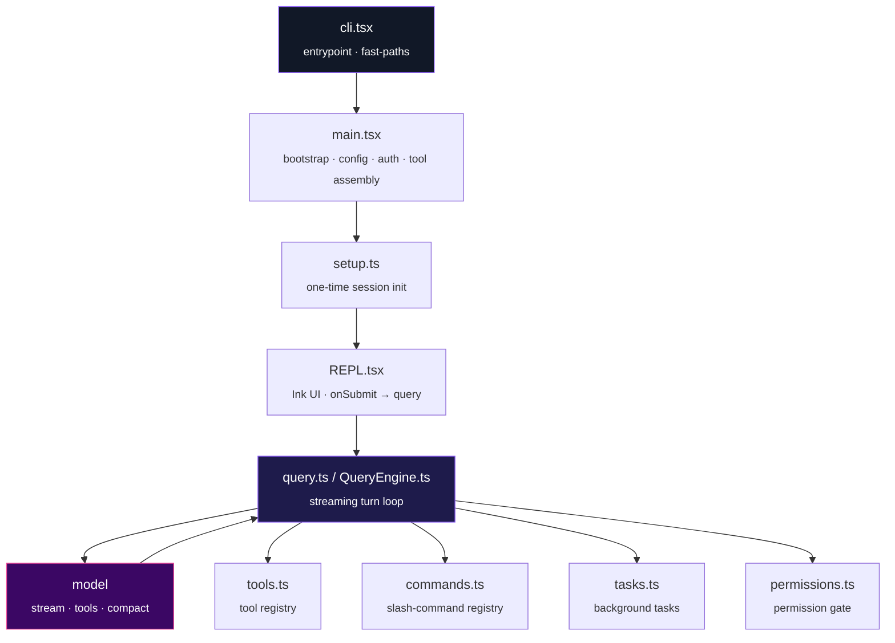
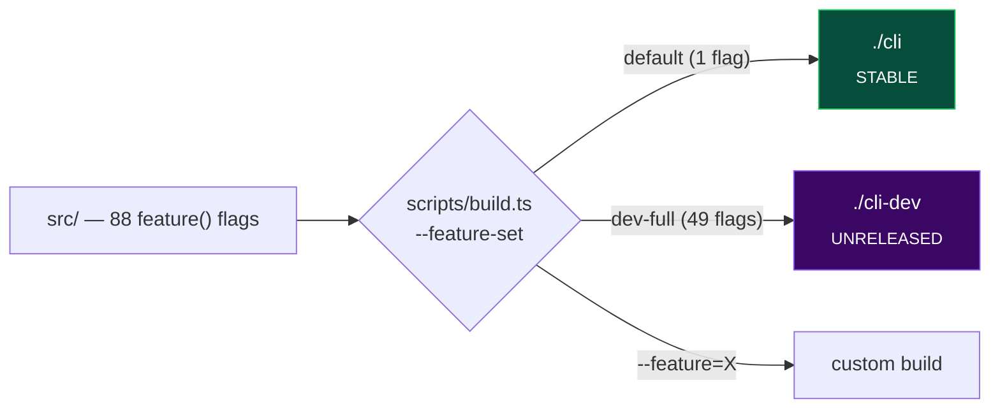
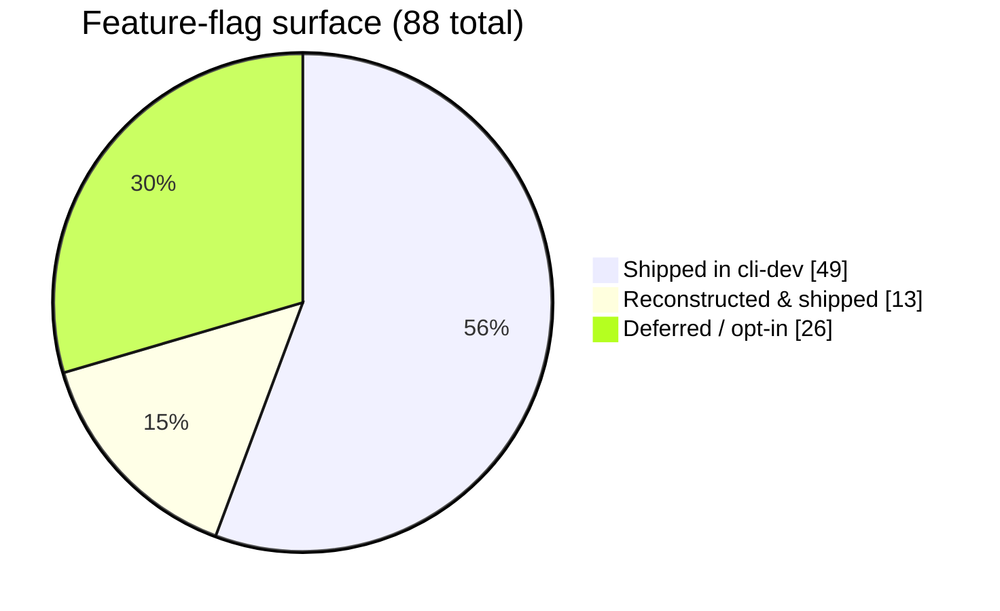
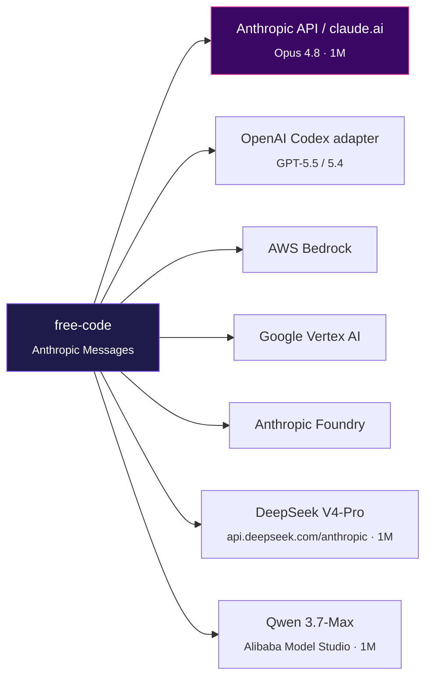

<div align="center">


# free-code

### The free build of Claude Code — telemetry stripped, guardrails removed, experimental features unlocked & **reconstructed**.

<br/>

[](#-build)
[](https://bun.sh)
[](https://www.typescriptlang.org/)
[](#-license)

[](FEATURES.md)
[](#-model-providers)
[](#-model-providers)
[](#-reconstruction-status)
[](#-maintainer)

<sub>One binary · zero callbacks home · seven model providers · up to a 1M-token window</sub>

</div>

---

## ✨ What is this

A clean, buildable fork of Anthropic's [Claude Code](https://docs.anthropic.com/en/docs/claude-code) CLI — the terminal-native AI coding agent. The upstream source became publicly available on **March 31, 2026** through a source-map exposure in the npm distribution. `free-code` applies four categories of work on top of that snapshot:

| | Category | What it means |
|:--:|---|---|
| 🛰️ | **Telemetry removed** | OpenTelemetry/gRPC, GrowthBook reporting, Sentry, and event logging are dead-code-eliminated or stubbed. GrowthBook gates still evaluate locally (needed for runtime feature flags) but **never report home**. |
| 🔓 | **Guardrails removed** | The CLI's prompt-level refusal patterns, injected "cyber-risk" blocks, and managed-settings overlays are stripped. The model's own safety training still applies — this only removes the extra wrapper layer. |
| 🧪 | **Experimental features unlocked** | Claude Code ships **88** `bun:bundle` compile-time feature flags, most disabled in the public release. The full build enables a curated set. |
| 🧩 | **Missing features reconstructed** | The leaked snapshot was missing source files for dozens of flags. **13 of them have been rebuilt** to their original call-site contracts and verified to compile + boot. → [Reconstruction status](#-reconstruction-status) |

> [!NOTE]
> `free-code` is a **nominative fork** — it references "Claude Code" only to describe what it forks. It is maintained independently by **Profexor** and is not affiliated with or endorsed by Anthropic.

---

## 🏛️ Architecture

The CLI is a thin bootstrap that fans out into a streaming agent loop. `feature('FLAG')` is a Bun compile-time macro: disabled branches are dead-code-eliminated, so the stable binary stays lean while the dev binary compiles the experimental surface in.



📖 Full deep-dive with subsystem maps: **[docs/ARCHITECTURE.md](docs/ARCHITECTURE.md)**

---

## 🚩 The feature-flag system

Every flag is a `feature('NAME')` macro resolved at **build time**. The build script chooses which flags to compile in:



| | `./cli` — **stable** | `./cli-dev` — **unreleased** |
|---|---|---|
| Build | `bun run build` | `bun run build:dev:full` |
| Flags compiled in | `VOICE_MODE` only | **49** experimental flags |
| Defines | `USER_TYPE=external` | + `CLAUDE_CODE_EXPERIMENTAL_BUILD=true` |
| Posture | Production-like, minimal surface | Everything unlocked + reconstructed |

Build is **fast** — a full `cli-dev` is ~4 s (≈5,700 modules bundled + bytecode-compiled by Bun).

---

## 🧩 Reconstruction status

The leaked snapshot referenced flags whose source files were missing — enabling them broke the build. **13 high-value flags have been reconstructed** (files rebuilt to their exact call-site contracts, verified per-flag, then shipped in `cli-dev`).



<table>
<tr><th>Wave</th><th>Flag</th><th>Restores</th></tr>
<tr><td rowspan="8"><b>Wave 1</b></td><td><code>BG_SESSIONS</code></td><td><code>ps</code>/<code>logs</code>/<code>attach</code>/<code>kill</code> background sessions + <code>--bg</code></td></tr>
<tr><td><code>FORK_SUBAGENT</code></td><td><code>/fork</code> conversation branching</td></tr>
<tr><td><code>MONITOR_TOOL</code></td><td>watch-a-command Monitor tool + background task</td></tr>
<tr><td><code>MCP_SKILLS</code></td><td>skills sourced from MCP <code>skill://</code> resources</td></tr>
<tr><td><code>BUDDY</code></td><td><code>/buddy</code> terminal companion</td></tr>
<tr><td><code>AUTO_THEME</code></td><td>live light/dark terminal detection (OSC 11)</td></tr>
<tr><td><code>COMMIT_ATTRIBUTION</code></td><td>commit/PR attribution trailers + hooks</td></tr>
<tr><td><code>CONTEXT_COLLAPSE</code></td><td><code>CtxInspect</code> tool over the collapse subsystem</td></tr>
<tr><td rowspan="5"><b>Wave 2</b></td><td><code>HISTORY_SNIP</code></td><td><code>Snip</code> tool + <code>/force-snip</code> to drop history ranges</td></tr>
<tr><td><code>TEMPLATES</code></td><td><code>new</code>/<code>list</code>/<code>reply</code> job CLI subcommands</td></tr>
<tr><td><code>REACTIVE_COMPACT</code></td><td>413 / prompt-too-long recovery compaction</td></tr>
<tr><td><code>RUN_SKILL_GENERATOR</code></td><td>bundled skill that scaffolds new skills</td></tr>
<tr><td><code>WEB_BROWSER_TOOL</code></td><td>fetch-and-read web tool (dependency-light)</td></tr>
</table>

<details>
<summary><b>Deferred on purpose</b> (reconstructable, but not shipped on-by-default)</summary>

| Flag | Why deferred |
|---|---|
| `MEMORY_SHAPE_TELEMETRY` | Telemetry — against this fork's no-telemetry posture |
| `OVERFLOW_TEST_TOOL` | Test scaffolding only, no user value |
| `TRANSCRIPT_CLASSIFIER` | The auto-approve permission classifier — a safety boundary that should be **opt-in** |
| `DIRECT_CONNECT` | Needs the full `claude server` subsystem (L/XL); `parseConnectUrl.ts` groundwork is already in place |
| `KAIROS` · `PROACTIVE` · `KAIROS_DREAM` | Large always-on assistant stacks; backend-coupled |
</details>

Full audit of all 88 flags → **[FEATURES.md](FEATURES.md)**.

---

## 🌐 Model providers

`free-code` speaks the Anthropic Messages format internally and routes it to **seven** backends. Third-party Anthropic-compatible endpoints pass through natively; OpenAI/Codex goes through a translation adapter.



Each provider has a dedicated, **tuned** launcher that maximizes its context window and tool-use fidelity:

| Launcher | Model | Context window | Highlights |
|---|---|---:|---|
| `freecode-launch.sh` | Claude Opus 4.8 `[1m]` | **1M** | native subscription, adaptive thinking, 128K output |
| `launch-claude-opus45.sh` | Claude Opus 4.8 `[1m]` | **1M** | OAuth-clean, `/model` picker entry |
| `launch-gpt.sh` | GPT-5.5 (or 5.4) | 400K–1.05M | Codex adapter, `xhigh` reasoning, verbosity `medium` |
| `launch.sh` | DeepSeek V4-Pro | **1M** | beta-strip for 3P fidelity, 64K output |
| `launch-qwen37.sh` | Qwen 3.7-Max | **1M** | beta-strip, prompt caching preserved |

> [!TIP]
> Two source patches make this possible: `CLAUDE_CODE_MAX_CONTEXT_TOKENS` is honored in external builds (so third-party 1M models budget correctly instead of defaulting to 200K), and the latest Opus output ceiling was lifted to 128K. Details in **[docs/ARCHITECTURE.md](docs/ARCHITECTURE.md#model--provider-resolution)**.

<details>
<summary><b>Context windows at a glance</b></summary>

| Model | Context | Max output | Notes |
|---|---:|---:|---|
| Claude Opus 4.8 `[1m]` | 1,000,000 | 128,000 | native 1M beta |
| GPT-5.4 | 1,050,000 | 128,000 | xhigh reasoning |
| GPT-5.5 | 1,000,000 (400K Codex) | — | strongest long-context |
| DeepSeek V4-Pro | 1,048,576 | 384,000 | reasoning consumes context |
| Qwen 3.7-Max | 1,000,000 | 65,536 | agent-tuned, verbose |
</details>

---

## ⚡ Quick install

```bash
curl -fsSL https://raw.githubusercontent.com/jennofrie/free-code/main/install.sh | bash
```

Checks your system, installs Bun if needed, clones the repo, builds with the full feature set, and symlinks `free-code` onto your `PATH`. Then run `free-code` and `/login`.

## 🔨 Build

```bash
git clone https://github.com/jennofrie/free-code.git
cd free-code
bun install
bun run build      # → ./cli       (stable)
bun run build:dev:full   # → ./cli-dev (all experimental flags)
```

| Command | Output | Features |
|---|---|---|
| `bun run build` | `./cli` | `VOICE_MODE` only |
| `bun run build:dev` | `./cli-dev` | dev version stamp |
| `bun run build:dev:full` | `./cli-dev` | **all 49 experimental flags** |
| `bun run compile` | `./dist/cli` | alternative output path |
| `bun run ./scripts/build.ts --feature=X` | custom | enable specific flags |

## ▶️ Usage

```bash
./cli                              # interactive REPL
./cli -p "what files are here?"    # one-shot
./cli --model claude-opus-4-8      # specify model
./launch-gpt.sh                    # GPT-5.5 via Codex
./launch.sh                        # DeepSeek V4-Pro (1M)
./cli ps                           # list background sessions (BG_SESSIONS)
```

---

## 🎙️ Voice mode

`/voice` (push-to-talk dictation) is compiled into every build, but it has two halves with different requirements:

- 🎙️ **Recording** uses [SoX](http://sox.sourceforge.net/) (`brew install sox`) — provider-agnostic.
- 🧠 **Transcription** uses Anthropic's `voice_stream` endpoint — **claude.ai-OAuth only** (not API keys, Bedrock, Vertex, Foundry, or OpenAI/Codex).

| Launcher / binary | `/voice` |
|---|---|
| `freecode-launch.sh`, `launch-claude-opus45.sh` | ✅ launch with `FREECODE_VOICE=1` |
| `cli` / `cli-dev` after `/login` to claude.ai | ✅ |
| `launch.sh` (DeepSeek), `launch-qwen37.sh` (Qwen), `launch-gpt.sh` (GPT) | ❌ transcription is claude.ai-only |

**To use it:** `brew install sox`, then `FREECODE_VOICE=1 ./freecode-launch.sh`, `/login` to your claude.ai account, run `/voice`, and hold **Space** to talk. The `FREECODE_VOICE=1` flag loads user settings so the toggle persists — the Claude launchers are OAuth-clean and don't load them by default.

## 🗂️ Project structure

```
scripts/build.ts          # feature-flag build system
src/
  entrypoints/cli.tsx      # CLI entrypoint
  main.tsx                 # bootstrap (config, auth, tool/MCP/agent assembly)
  setup.ts                 # one-time session init
  screens/REPL.tsx         # Ink/React interactive UI
  query.ts · QueryEngine.ts# streaming turn loop
  commands.ts · tools.ts · tasks.ts   # registries
  commands/ · tools/ · tasks/          # implementations (incl. reconstructed)
  services/                # API clients, OAuth/MCP, compaction, analytics stubs
  utils/model/             # provider routing, context/effort resolution
  skills/ · plugins/ · bridge/ · voice/
docs/ARCHITECTURE.md       # architecture deep-dive
```

## 🧰 Tech stack

| | |
|---|---|
| **Runtime** | [Bun](https://bun.sh) ≥ 1.3.11 |
| **Language** | TypeScript 5.x |
| **Terminal UI** | React 19 + [Ink](https://github.com/vadimdemedes/ink) |
| **CLI parsing** | Commander.js · **Validation** Zod v4 |
| **Protocols** | MCP · LSP |
| **APIs** | Anthropic Messages · OpenAI Codex · Bedrock · Vertex · Foundry |

---

## 🗺️ Roadmap

- [x] Audit the full 88-flag surface (stable vs unreleased)
- [x] **Wave 1** — reconstruct 8 high-value flags
- [x] **Wave 2** — reconstruct 5 more flags
- [x] Per-provider launcher tuning + 1M context patches
- [ ] `DIRECT_CONNECT` — reconstruct the `claude server` subsystem
- [ ] Opt-in reconstructions (`TRANSCRIPT_CLASSIFIER`, …)
- [ ] Continuous `FEATURES.md` / docs sync

---

## 🤝 Contributing

Contributions are welcome — especially restoring more of the broken flags. Start with **[CONTRIBUTING.md](CONTRIBUTING.md)**: it documents the build, the reconstruction workflow (rebuild a missing file to its call-site contract → verify with a per-flag build → ship), and the conventions.

## 🔐 Security

Found a vulnerability or a leaked secret in history? See **[SECURITY.md](SECURITY.md)** for responsible-disclosure guidance. Never commit `.env*`, API keys, or tokens — they are git-ignored by default.

## 📜 Changelog

See **[CHANGELOG.md](CHANGELOG.md)** for the full history, including the audit, the two reconstruction waves, and the provider-tuning work.

---

## 👤 Maintainer

Built and maintained by **Profexor**.

> The original Claude Code source is the property of Anthropic. This fork exists because the source was publicly exposed through Anthropic's own npm distribution; it is referenced nominatively to describe what `free-code` is. Use at your own discretion.

## 📄 License

Source-available. The upstream Claude Code source remains the property of Anthropic. This repository carries no warranty.

<div align="center"><sub>Maintained by <b>Profexor</b> · built with Bun · no telemetry, no callbacks home</sub></div>
