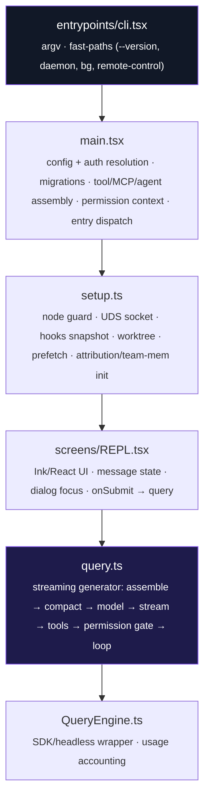
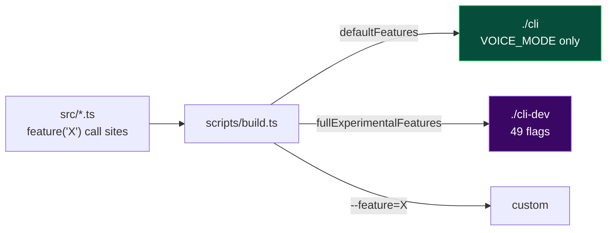
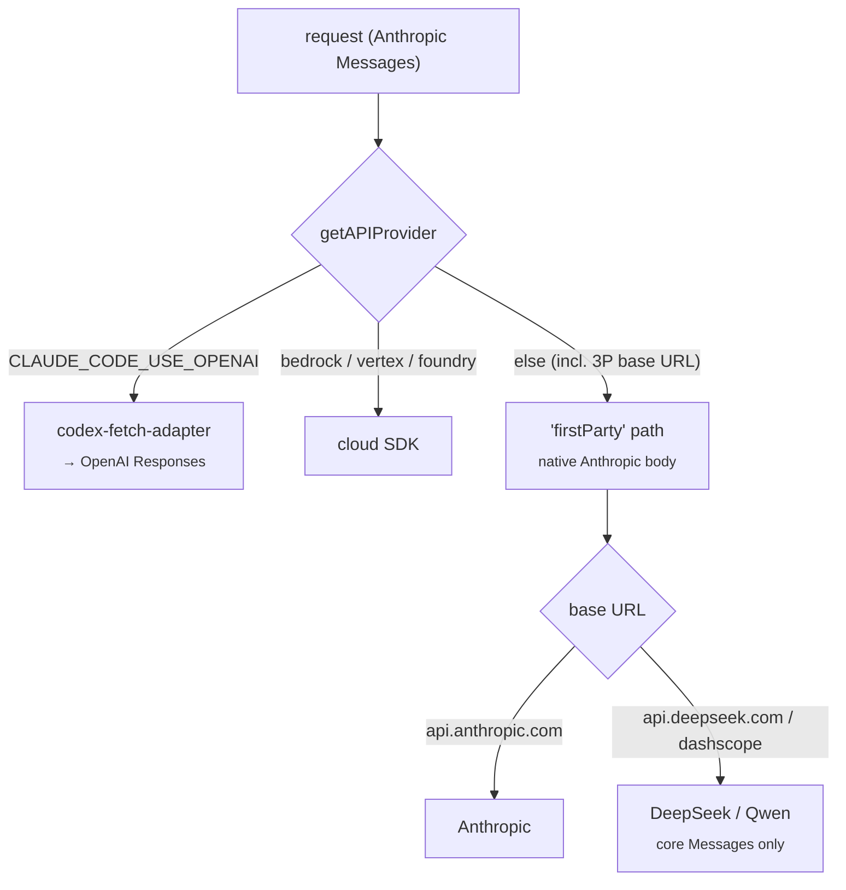

# Architecture

A map of how `fexor-code` is put together — the boot path, the compile-time
feature-flag system, the streaming agent loop, and how a request is routed and
sized per provider.

## Boot path

Registries assembled at bootstrap and consumed by the loop:

| Registry | Provides |
|---|---|
| `tools.ts` (`getTools`/`assembleToolPool`) | agent tools (Bash, Read, Edit, MCP, reconstructed tools) |
| `commands.ts` (`getCommands`) | slash commands |
| `tasks.ts` (`getAllTasks`) | background task types |
| `utils/permissions/permissions.ts` | the permission decision gate |

## The feature-flag system

`feature('NAME')` is imported from `bun:bundle` — a **compile-time macro**. At
bundle time it is replaced with `true`/`false` based on the `--feature=NAME`
flags passed to `bun build`, and disabled branches are dead-code-eliminated.

- The macro **must** appear as the direct condition of an `if`/ternary.
- An enabled flag whose gated `require()` targets a missing file breaks the
  build — this is the failure mode the reconstruction work resolves.
- Type-only imports (`import type { … }`) of missing modules are erased by Bun
  and do **not** break the build.

## Subsystems

| Directory | Purpose |
|---|---|
| `services/` | API clients (`api/claude.ts`, `withRetry`), OAuth/MCP, compaction (`autoCompact`, `microCompact`, `reactiveCompact`, `snipCompact`), analytics **stubs** |
| `services/api/codex-fetch-adapter.ts` | translates Anthropic Messages → OpenAI Responses for GPT/Codex |
| `utils/model/` | provider routing, context-window/output/effort resolution, capability overrides |
| `state/` | single app store (REPL + permission gate) |
| `hooks/` · `components/` | Ink UI |
| `bridge/` · `remote/` · `coordinator/` | remote-control / multi-agent surfaces (mostly experimental) |
| `skills/` · `plugins/` · `voice/` · `tasks/` | extension surfaces |

## Model & provider resolution

`fexor-code` always speaks Anthropic Messages internally. The **provider** is
decided only by `CLAUDE_CODE_USE_*` env vars (not by `ANTHROPIC_BASE_URL`), which
has important consequences for third-party endpoints.

### Context window

Resolved in `utils/context.ts:getContextWindowForModel`, in precedence order:

1. `CLAUDE_CODE_MAX_CONTEXT_TOKENS` — **honored in external builds** (patched; was `ant`-only). Client-side budgeting value; never sent to a provider.
2. `[1m]` model-suffix → 1,000,000 (stripped from the model id before the wire).
3. GPT-5.4 special case → 1,050,000.
4. Otherwise → **200,000 default** for unknown models.

> Third-party 1M models (DeepSeek, Qwen) are unknown to the table and would
> default to 200K — so the launchers set `CLAUDE_CODE_MAX_CONTEXT_TOKENS=1000000`
> instead of using `[1m]` (which would inject the Anthropic-only `context-1m`
> beta those endpoints reject).

### Output tokens

`getModelMaxOutputTokens` keys off the canonical model name; `CLAUDE_CODE_MAX_OUTPUT_TOKENS`
overrides up to the per-model upper limit. Opus 4.7/4.8 were patched to 64K/128K
(previously capped at 32K).

### Third-party fidelity

Because DeepSeek/Qwen are classified `firstParty`, they would otherwise receive
Anthropic-proprietary betas and experimental tool-schema fields. The launchers
set `CLAUDE_CODE_DISABLE_EXPERIMENTAL_BETAS=1` (strips betas + `strict`/`defer_loading`/`eager_input_streaming`)
and `DISABLE_INTERLEAVED_THINKING=1`. Base prompt caching (`cache_control`) is preserved.

### GPT/Codex

The adapter targets the Codex Responses backend (OAuth-only), maps `max` effort →
`xhigh` (gpt-5.4/5.5), and reconstructs streamed tool-call deltas. Known gaps:
tool-result images are dropped, and a specific tool can't be force-selected
(`tool_choice` degrades to `auto`).

---

Maintained by **Profexor**.
